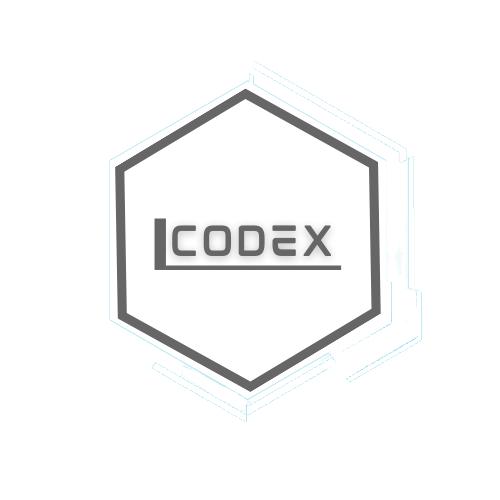

# CODEX
<!--
*** Thanks for checking out the Best-README-Template. If you have a suggestion
*** that would make this better, please fork the repo and create a pull request
*** or simply open an issue with the tag "enhancement".
*** Thanks again! Now go create something AMAZING! :D
-->

<!-- PROJECT SHIELDS -->
<!--
*** I'm using markdown "reference style" links for readability.
*** Reference links are enclosed in brackets [ ] instead of parentheses ( ).
*** See the bottom of this document for the declaration of the reference variables
*** for contributors-url, forks-url, etc. This is an optional, concise syntax you may use.
*** https://www.markdownguide.org/basic-syntax/#reference-style-links
-->
[![Contributors][contributors-shield]][contributors-url]
[![Forks][forks-shield]][forks-url]
[![Stargazers][stars-shield]][stars-url]
[![Issues][issues-shield]][issues-url]
[![MIT License][license-shield]][license-url]
[![LinkedIn][linkedin-shield]][linkedin-url]

<!-- PROJECT LOGO -->
 

  

  <h3 align="center">CODEX - Coding Experience</h3>

  

    Uma nova maneira de ver o inicio de uma aventura!
     
    <a href="https://github.com/HenriqueCardoso-Dev"><strong>Explore os documentos »</strong></a>
     
     
    <a href="https://github.com/HenriqueCardoso-Dev/CODEX">Ver demonstração</a>
    ·
    <a href="https://github.com/HenriqueCardoso-Dev/CODEX/issues">Reportar Bug</a>
    ·
    <a href="https://github.com/HenriqueCardoso-Dev/CODEX/issues">Solicitar Recurso</a>
  

<!-- TABLE OF CONTENTS -->

  
Tabela de conteudo

  <ol>
    <li>
      <a href="#about-the-project">Sobre o Projeto</a>
      <ul>
        <li><a href="#built-with">Ferramentas que Utilizamos</a></li>
      </ul>
    </li>
    <li>
      <a href="#getting-started">Getting Started</a>
      <ul>
        <li><a href="#prerequisites">Prerequisites</a></li>
        <li><a href="#installation">Installation</a></li>
      </ul>
    </li>
    <li><a href="#usage">Usage</a></li>
    <li><a href="#roadmap">Roadmap</a></li>
    <li><a href="#contributing">Contributing</a></li>
    <li><a href="#license">License</a></li>
    <li><a href="#contact">Contact</a></li>
    <li><a href="#acknowledgements">Acknowledgements</a></li>
  </ol>

<!-- ABOUT THE PROJECT -->
## Sobre o Projeto

[![Product Name Screen Shot][product-screenshot]](https://example.com)

O projeto CODEX tem como objetivo o desenvolvimento de um aplicativo para treinamento, inserção e reforço das habilidades de desenvolver códigos em diferentes linguagens de programação.

A inspiração do app foi fudamentada com base no aplicativo Duolingo, desenvolvido para o aprendizado e treinamento de um novo idioma. O CODEX funciona de forma parecida, onde o usuário pode começar a aprender, dando seus primeiros passos nesse universo gigantesco da programação.

"Mas como eu sei se o CODEX é a melhor opção para meu início?"

O CODEX pode te ajudar, se:
* você sente dificuldade em se adaptar com outros apps, que na maioria das vezes não possuem versões pára seu idioma nativo.
* Você precisa de algo que possa treinar seus exercícios em qualquer lugar que esteja.
* Você deseja dar uma oportunidade ao roxinho dos devs iniciantes! 💜

A proposta da nosssa equipe com o cliente é bem clara. "Trazer sempre uma inovação, quando o assunto é comodidade do usuário,". Tentamos trazer conosco uma ideia de acolher o usuário da melhor maneira possível, pensando em todas as possibilidades de melhoria dentro da nossa realidade.

Acreditamos que o CODEX pode vir a se tornar uma alternativa poderosa no mercado daqui a um tempo se as metas forem atingidas.

### Ferramentas que Utilizamos

O time CODEX trabalha com diversas tecnologias diferentes para atingirmos todos os nossos objetivos, e também estudamos aquilo que pode ser promissor para nós em um outro momento. Atualmente o projeto está sendo desenvolvido com as seguintes tecnologias:
* [PHP](https://www.php.net)
* [Sass](https://sass-lang.com)
* [Ionic - Angular](https://ionicframework.com)
* [MySQL](https://www.mysql.com)
* [JavaScript](https://www.javascript.com)

<!-- MARKDOWN LINKS & IMAGES -->
<!-- https://www.markdownguide.org/basic-syntax/#reference-style-links -->
[contributors-shield]: https://img.shields.io/github/contributors/HenriqueCardoso-Dev/CODEX.svg?style=for-the-badge
[contributors-url]: https://github.com/HenriqueCardoso-Dev/CODEX/graphs/contributors
[forks-shield]: https://img.shields.io/github/forks/HenriqueCardoso-Dev/CODEX.svg?style=for-the-badge
[forks-url]: https://github.com/HenriqueCardoso-Dev/CODEX/network/members
[stars-shield]: https://img.shields.io/github/stars/HenriqueCardoso-Dev/CODEX.svg?style=for-the-badge
[stars-url]: https://github.com/HenriqueCardoso-Dev/CODEX/stargazers
[issues-shield]: https://img.shields.io/github/issues/HenriqueCardoso-Dev/CODEX.svg?style=for-the-badge
[issues-url]: https://github.com/HenriqueCardoso-Dev/CODEX/issues
[license-shield]: https://img.shields.io/github/license/HenriqueCardoso-Dev/CODEX.svg?style=for-the-badge
[license-url]: https://github.com/HenriqueCardoso-Dev/CODEX/blob/master/LICENSE.txt
[linkedin-shield]: https://img.shields.io/badge/-LinkedIn-black.svg?style=for-the-badge&logo=linkedin&colorB=555
[linkedin-url]: https://linkedin.com/in/henriquecardoso-dev
[product-screenshot]: https://user-images.githubusercontent.com/63278045/117742901-1fd66d80-b1dc-11eb-924c-6d6809fda12f.png
